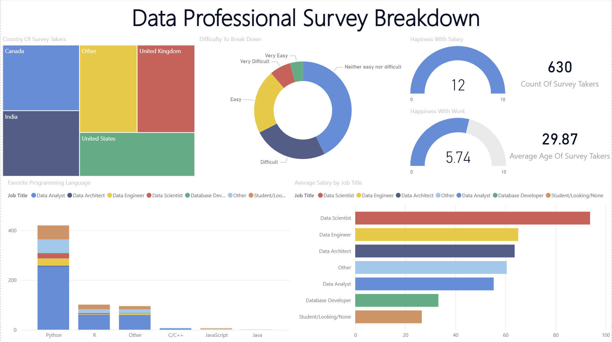

# Data Professional Survey Breakdown — Power BI Dashboard

An interactive Power BI dashboard built on real survey data 
collected from data professionals worldwide.

---

## Dashboard Overview

---

## Key Questions Explored

- Which countries do most data professionals come from?
- What is the average salary by job title (Data Analyst, Engineer, Scientist etc.)?
- Which programming language is most popular among data professionals?
- How happy are professionals with their salary and work-life balance?
- How difficult was it to break into the data field?

---

## Key Insights

- **Python** is the most preferred programming language across all roles
- **Data Scientists** earn the highest average salary
- Average happiness with salary is notably lower than work-life balance satisfaction
- Most respondents found breaking into data **neither easy nor difficult**

---

## Skills Demonstrated

- Data transformation and cleaning using **Power Query**
- Building interactive visuals (bar charts, treemaps, gauges, donut charts)
- Creating calculated columns and measures
- Dashboard design and layout in Power BI Desktop

---

## Tools Used

- Microsoft Power BI Desktop
- Power Query (for data cleaning)

## Dataset

Real survey data collected by [Alex The Analyst](https://github.com/AlexTheAnalyst)
